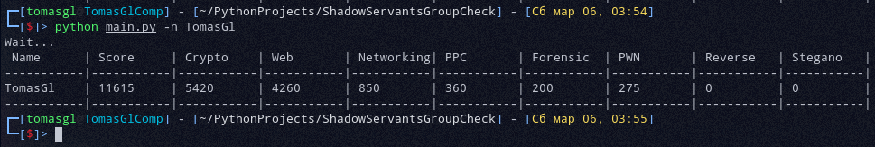
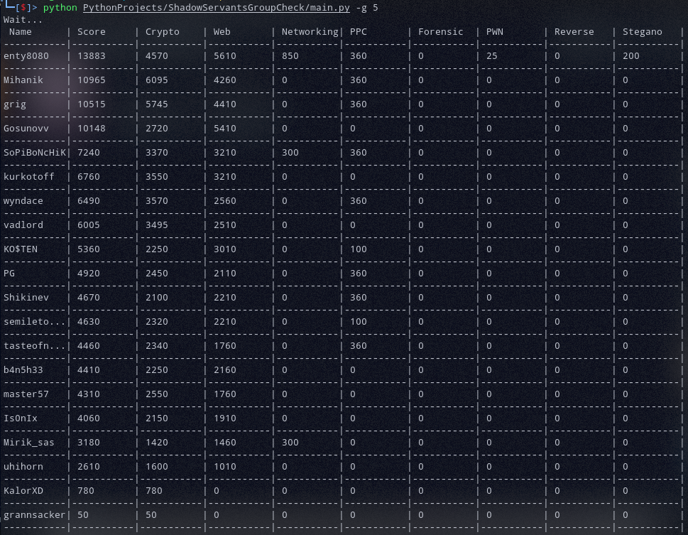

# ShadowServantsGroupCheck


### Конфиг в начале скрипта:

```py
session_cookie = '<здесь кук "session" из залогиненой сессии на shadowservants.ru (для доступа к стоимости тасков)>'
```

# Запуск:

### Справка:
```shell
$ python main.py --help
usage: main.py [-h] [-i ID] [-n NICK]

optional arguments:
  -h, --help            show this help message and exit
  -i ID, --group-id ID  Вывести всех участников группы (по умолчанию: 5)
  -n NICK, --nick NICK  Вывести игрока
```

### Вывести score игрока:
```shell
$ python main.py -n TomasGl
```

### Вывести score всех участников группы (по умлочанию 5):

```shell
$ python main.py -i 5
```

# Скриншоты:



