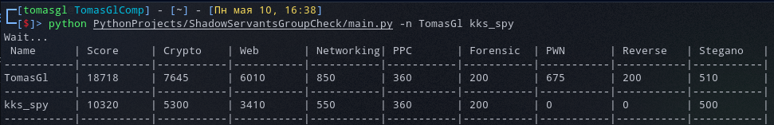

# ShadowServantsGroupCheck


### Конфиг в начале скрипта:

```py
session_cookie = '<здесь кук "session" из залогиненой сессии на shadowservants.ru (для доступа к стоимости тасков)>'
```

# Запуск:

### Вывести score игрока:
```shell
$ python main.py -n TomasGl
```

### Вывести score всех участников группы (по умлочанию 5):

```shell
$ python main.py -i 5
```

# Скриншоты:


